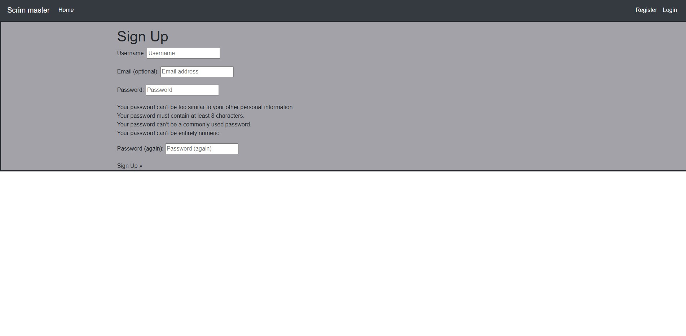

<h1>Scrims</h1>

Scrims is a user orientate website allows people who wish to play a game competitavly, but struggle to find motivated groups with the same mindset

<h1>Project Goals and User Experience</h1>
<h2>Project Goals</h2>

<ol>
  <li>The objective of this project is to make a interactive website that allows players to join and leave teams giving them the flexibility to choose a team of their ability.</li>
  <li>The project must be easy to navigate, fufilling the function of bring likeminded players together.</li>
</ol>
<h2>User Stories</h2>

<ol>
  <li>As a first time user I want to be able to create an account to view the teams posting. This will be achievable when a sing up button is avalable and allows me to fill in my details</li>
  <li>As a first time user I want to be able to see what teams are posting and the skill group they play at. This will be shown by a ranks system correlating to the game to give me an idea of their skill level.</li>
  <li>As a first time user I want to start my own team. This will be achievable when I have a create a team button allowing me to fill in information like team name and rank.</li>
  <li>As a returning user I want to be able to see who has joined my team. This is achieved by viewing the teams post which will update when a user joins the team.</li>
  <li>As a returning user I want to be able to delete my team as the team has disbanded. This can be done by adding a delete team button for the desired team.</li>
</ol>
<h1>Design</h1>

The fonts Arial, Helvetica, sans-serif were used for their simplistic and easy to read design.

<h2>Colour Palette</h2>

<a href="https://coolors.co/">Coolers was used to generate the colour scheme.</a>

A minimalistic design approach was chosen to allow for quicker navigation and reduce clashing of colours. This gives it a professional but simple feel.

<h1>Wireframes</h1>

Desktop Home page Desktop

View Profile and teams page Desktop

Create a team form Desktop

Log in/out Desktop

Desktop Home page Mobile

View Profile and teams page Mobile

Create a team form Mobile

Log in/out Desktop

<h1>Features</h1>

The user has the ability to create an account and log-in to the website giving access to the "LFG" page allowing the user to post and join teams.

View of the lfg from an admin/superuser having access to delete all posts

This is what the user can see when they click on a lfg post, they have access to the join button which allows them to join the team slot.

<h1>Testing</h1>

Manual Testing is the user/programmer checking code visually and comparing it to the results of the visual product. Check if buttons/links work, making sure code is outputting the correct response.

<h2>Manual Testing</h2>

<ul>
  <li>All Forms work posting correctly</li>
  <li>All buttons work and display a related swal message to the user on success.</li>
  <li>The website has been tested in multiple resolutions allowing for flexability to the user on Pc, phone or tablet.</li>
  <li>Login and logout feature both work and give a response to the user when done./li>
  <li>Creating an account works and auto sings the user in once done.</li>
  <li>Uploading a picture works and if the user chooses not to a default image is applied.</li>
  <li>All links have reactive css that change colour on hover that works.</li>
  <li>Links to templates work and display the correct template.</li>
</ul>
<h3>Bugs</h3>
<ul>
  <li>When selecting a team using the lfp form all users could see every team, this was an issue as I only wanted users too see teams they had created. To fix this I added a unique owner to each team to taget when loading the teams.</li>
  <li>The lfg table was causing the page to be oversized due to the format, changed the location of the <tr> and <td> to stop the table breaking its container.</li>
  <li>Had an issue with the database getting confused with migration and wouldn't allow me to migrate or flush had to load previous commit to allow for a flush before changing variable names to allow for better readability.</li>
  <li>Had an issue with slugs that were generated for the html overlapping with teams with the same name causing the server to crash. Added a unique slug generater that took the name of the team and added 1 for each team with that name.</li>
</ul>
<h2>Automated Testing</h2>

Automated Testing is the use of external software to check for errors in the code and to highlight them to be addressed.

<h2>Html</h2>

W3C markup was used to validate my html

<h2>CSS</h2>

W3 Jigsaw was used to check the css used in my project and has passed with no issues.

<h2>Lighthouse</h2>

I used lighthouse to test load times/performace of my website with good results

<h1>JS and Python</h1>

I used Es lint and pythons extention to validate the JS and python in my project. The only things flagged are unkown words I have used for variables and lines too long which doesnt cause any issues and is still readable.

<h1>User Stories</h1>

<ol>
  <li>As a first time user I want to be able to create and account. I have done this utilizing the sign up link allowing me to enter a username and password.</li>
  
  <li>As a first time user I want to be able to See what teams are posting. I have achieved this by opening the home page to see the teams names, ranks, date posted and a link to see further detail.</li>
  
  <li>As a first time user I want to be able to start my own team. I have done this by going to the create team link. This has allowed me to create my own custom team choosing the name rank and icon.</li>
  
  <li>As a returning user I want to be able to see whos on my team. When I got to the teams post I can clearly see that the user kirk has joined my team indicated by a new username being in the teams table.</li>
  
  <li>As a returning user I want to be able to delete my team as the team has disbanded. I can easily do this as on the post page all my LFG posts have a clear delete button next to the team.</li>
  
</ol>
<h1>Future additions</h1>
<ul>
  <li>User profile details like profile picture, rank, languages...</li>
  <li>add a way to challenge another team searching without having to contact the owner.</li>
  <li>Usernames on the team page will link to the user profile</li>
  <li>Notification system to show the user his team has a new member</li>
</ul>
<h3>How to Fork</h4>

To fork the scrims repository:

<ol>
  <li>Log in (or sign up) to Github.</li>
  <li>Go to the repository for this project, HTTPS://github.com/Howlerloud/scrims.</li>
  <li>Click the Fork button in the top right corner.</li>
  </ol>
<h3>How to Clone</h4>

To clone the scrims repository:

<ol>
  <li>Log in (or sign up) to GitHub.</li>
  <li>Go to the repository for this project, HTTPS://github.com/Howlerloud/scrims.</li>
  <li>Click on the code button, select whether you would like to clone with HTTPS, SSH or GitHub CLI and copy the link shown.</li>
  <li>Open the terminal in your code editor and change the current working directory to the location you want to use for the cloned directory.</li>
  <li>Type 'git clone' into the terminal and then paste the link you copied in step 3. Press enter.</li>
</ol>
<h1>Credits</h1>
<ul>
  <li>https://wireframe.cc/ to buld the wireframes</li>
  <li>Code institute for how to setup the structure of my project, python and javascript</li>
  <li>w3 schools for css and html</li>
  <li>Placeholder image for teams https://www.vhv.rs/dpng/d/493-4934854_hylian-shield-and-master-sword-pixel-art-hd.png</li>
</ul>
